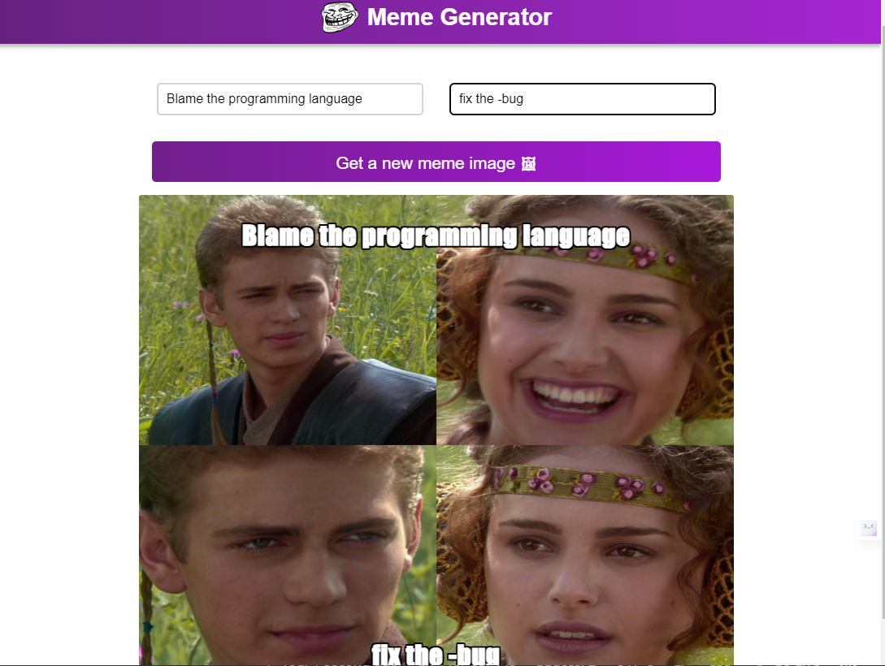

# Meme Generator

 ## Demo

 


## Installation

1. Clone the repository:

   ```bash
   git clone https://github.com/MehraDevesh2022/Meme-Generator.git
   cd MEME-GENERATOR
 
    ```
2. Install the dependencies:

   ```bash
   npm install
   ```
3. Start the server:

   ```bash
    npm start
    ```

## Contributing
    
Contributions are always welcome! add some more features and open a pull request!

