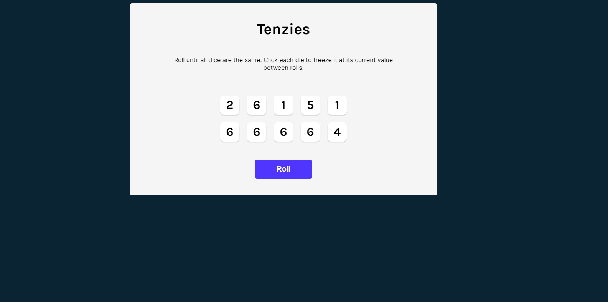
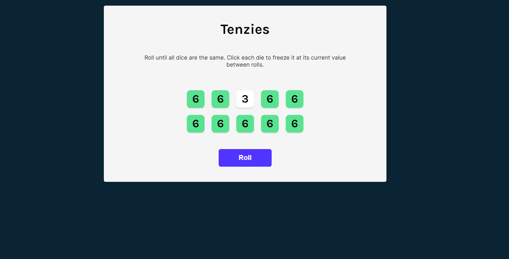
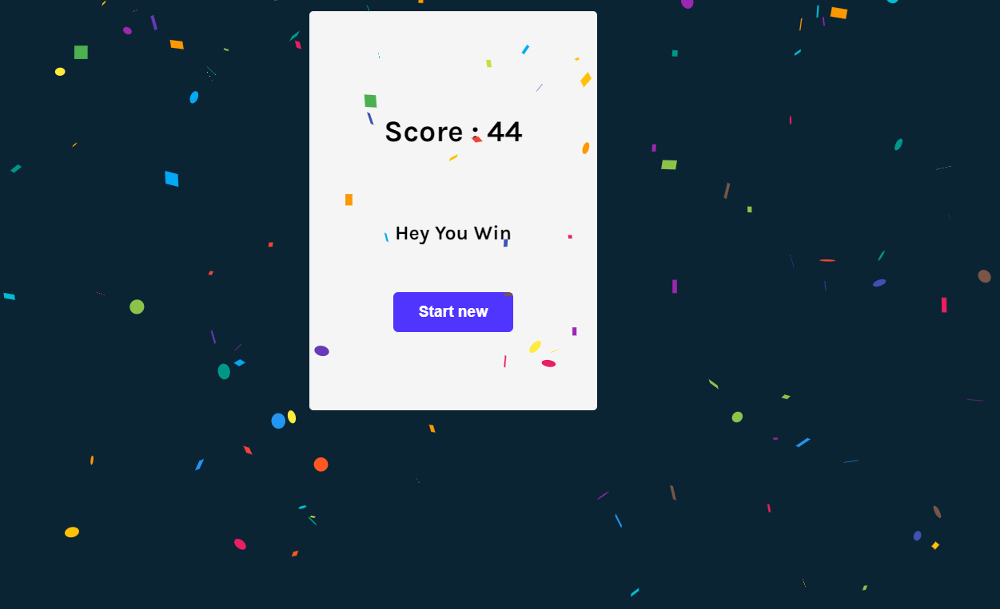

# Tenzies Game

Tenzies is a simple dice game implemented in a React app. The objective of the game is to roll the dice until all of them show the same number. You can freeze individual dice at their current value to strategize your rolls and achieve the goal. Enjoy the thrill of luck and strategy combined in this exciting game!

## Features

- Roll the dice to generate random values between 1 and 6.
- Click on individual dice to hold their current value for the next roll.
- Win the game by aligning all dice to the same number.
- Engaging UI with a confetti celebration upon winning.
- Keeps track of the number of rolls taken to win.

## Demo

  ### Landing Page :

  

    ### Rolling Dice :

  

    ### Winning the Game :

 

## Installation

To run the Tenzies game on your local machine, follow these steps:

1. Clone this repository to your local machine using:
 
```bash
git clone https://github.com/MehraDevesh2022/tenzies-game.git
```
 
2. Install the dependencies in the local node_modules folder using:
 
```bash
npm install
```

3. Run the app in development mode using:

```bash
npm start
```

4. Open http://localhost:3000 to view it in the browser.


## Usage

1. When you load the game, you'll see a set of 10 dice on the screen.
2. Click the "Roll" button to generate random values for each dice.
3. Click on individual dice to hold their current value for the next roll.
4. Keep rolling and holding dice until all 10 dice show the same number.
5. Once all dice have the same number, a confetti celebration will occur, and you win the game!
6. The game keeps track of the number of rolls you took to win.
## Technologies Used

- React: A JavaScript library for building user interfaces.
- nanoid: A small utility library for generating unique IDs.
- react-confetti: A library for adding confetti animations to your React app.

Feel free to explore the code in this repository, make modifications, and have fun!

## Contributing
  
Contributions are always welcome! Change UI and add features to make the game more engaging and fun. Feel free to open an issue to discuss what you would like to change.

 